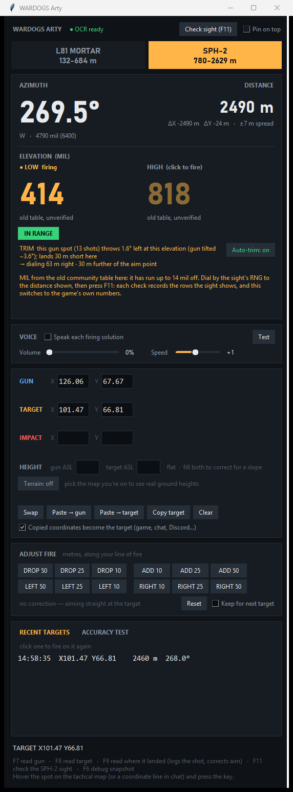

# ArtyDogs: WARDOGS artillery & mortar calculator

Hover a spot on the WARDOGS tactical map, press a key, and the firing solution
(azimuth, distance, elevation in MIL) appears in big type on your second monitor
and is read out loud. For the **L81 mortar** and the **SPH-2**.

<p align="center"></p>

**Why use it over a web calculator?**

- **No typing coordinates.** F7 reads your gun and F8 the target straight off the map.
- **The game's own numbers.** The community firing table has drifted: on the
  SPH-2 low arc it is up to **14 mil / 71 m** off what the gun sight itself
  prints. ArtyDogs uses the sight's own range table wherever it has been seen
  (see *The game's own firing table* below).
- **It learns your gun.** Mark where a shell landed (F9) and it corrects the next
  shot. After 3 shots from one spot it also works out that spot's steady error,
  such as a tilted gun pulling left.
- **Hands-free.** It speaks the solution, and F11 checks your sight and tells
  you how far to turn and elevate.

While the tactical map is open, WARDOGS draws a crosshair through your mouse and
labels its two rulers with the map coordinates, `y73.39` above and `x81.57`
below (1 unit = 100 m). When you press a hotkey, this app takes a screenshot,
reads both labels with OCR, and fills in your gun or target position. The
elevation comes from the community-measured firing tables for the L81 Mortar and
the SPH-2.

> **What it does, and doesn't do.** The app takes **one screenshot each time you
> press one of its keys** (the way Windows' own Snipping Tool does), reads the
> numbers the game prints, and shows the answer **in its own window**, on your
> second monitor. Nothing else:
>
> - **nothing runs in the background:** no screenshots unless you press a key
>   or button;
> - **nothing is drawn over the game:** no overlay, no markers on the sight;
> - **it never touches the game:** no memory reading, no injection, no files,
>   and it never presses a key or moves the mouse for you.
>
> It is still unofficial third-party software. The WARDOGS EULA (section 5.2(n))
> forbids "unauthorised third-party software", and BULKHEAD hasn't said whether
> calculators like this count. Read the rules and decide for yourself.

## Setup

**Download (Windows 10/11):** get `WARDOGS-Arty-vX.Y.Z-windows.zip` from the
**Releases** page on the right, unzip it anywhere you can write to (Desktop,
Documents), and run `WARDOGS-Arty.exe`. Nothing to install. Your settings, shot
logs and downloaded terrain are kept in that same folder.

- **"Windows protected your PC":** the app isn't code-signed yet, so SmartScreen
  doesn't know it. Click **More info → Run anyway**. The zip is built by GitHub
  from this source code (see `.github/workflows/release.yml`), so you can check
  exactly what's in it.
- **Is it complete?** Run `WARDOGS-Arty.exe --selftest`. It writes `selftest.txt`
  showing whether the firing tables, terrain and OCR engine all load.

**Or run from source:**

1. **Double-click `run.bat`.** The first run creates a private Python environment
   in `.venv` (about 260 MB: the OCR engine and its models). Later runs start in a
   couple of seconds. You need Python 3.10 or newer on PATH.

**Then, either way:**

2. **Set WARDOGS to Borderless or Windowed fullscreen.** Exclusive fullscreen can
   hide the game from screenshots, so the app would only see a black screen.
3. The window opens on your second monitor. Move or resize it and it remembers
   where you put it. **Pin on top** keeps it above other windows, which helps if
   you only have one monitor.

## Using it

| Key | What it does |
| --- | --- |
| **F7** | Read your **gun** position (hover your gun on the tactical map) |
| **F8** | Read the **target** (hover the target) |
| **F9** | Read where the shell actually **landed**: corrects the aim and logs the shot for the accuracy test |
| **F11** | **Check the sight** (SPH-2): reads the gun sight once and says how far to turn and elevate |
| **F6** | Save a debug snapshot (see Troubleshooting) |

1. Pick **L81 MORTAR** or **SPH-2** at the top.
2. Open the tactical map, hover your gun, press **F7**. Hover the target, press
   **F8**.
3. Read off **AZIMUTH** (compass degrees: 0 = north, 90 = east) and **ELEVATION
   (MIL)**. The SPH-2 shows LOW and HIGH arcs when both reach; below 1181 m only
   the high arc does. A red pill means the target is too close or too far, and by
   how much.
4. **Walk fire onto the target.** After a shot, hover where it actually hit and
   press **F9**. The app splits the miss into range and deflection (e.g. "18 m
   SHORT, 40 m RIGHT") and moves the aim point to cancel it, then shows the new
   solution. Each F9 refines it further. A new gun or target position, or
   **Reset adjust**, clears the correction.
5. **Height**, if you know it. The HEIGHT row takes both heights above sea level
   in metres. Your own is filled in automatically: the game shows `ASL` in the
   HUD, so the gun read picks it up a moment after the coordinates. Fill in the
   target's and the elevation is corrected for the slope; leave it blank and you
   get the flat solution. See *Height difference* below for what is covered.

> **Reading your gun (F7):** hover just *beside* your own icon, not on it. Your
> name tag (or a vehicle's info card) pops up over the coordinate labels. If it
> covers one, the app says so and asks you to nudge the cursor; a few metres
> off makes no difference to the shot.

More while you fire:

- **Spoken callouts.** The solution is read out, digit by digit, the moment it
  changes: *"Azimuth zero niner zero point zero. Elevation seven niner, low
  arc."* So you hear it while you close the map and turn to the sight. The
  mortar callout starts with the range, since its scope works in range lines.
  After F9 or a correction it starts with *"Corrected."*, and a read that
  needs a glance starts with *"Check reading."*. Short cues confirm the rest
  (*"Gun set."*, *"No reading."*). The VOICE card has an on/off switch,
  **Volume** and **Speed** sliders (let go of one to hear it) and a **Test**
  button. It uses Windows' built-in offline voice, so nothing to install.
- **Check the sight (F11, SPH-2).** In the gunner seat, press F11 and the app
  reads the sight **once**: the elevation and range at the reticle, the heading
  tape, the stabilization warning and the tilt pips. It says the whole
  correction in one go: *"Right 3.4. Up 12."* Dial that in and press F11 again
  until it says *"On target."* The window shows the same (`▶ 3.4°  ▲ 12 mil`,
  green when you're on). It also says *"Not stabilized."* when that warning is up,
  and fills in the gun's height from the sight's `ASL`. It never touches the
  controls: you turn and elevate. The **Check sight** button does the same.
- **Heights read themselves** where the game shows them: the gun's from the
  HUD or the sight, and a hovered object's from the small `RNG … / ASL …`
  label beside the cursor. That label is tiny and the crosshair often runs
  through it, so it is only used when several readings agree; otherwise the
  field is left for you.
- **Pick your arc.** The SPH-2 shows both arcs; click the one you're firing and
  it's marked `● firing`, and shots are logged against it.
- **Adjust fire.** The ADJUST FIRE buttons take a spotter's call — DROP 50, ADD
  25, LEFT 10 — and move the aim along your actual line of fire. **Keep for
  next target** carries a correction to the next target: it's stored as
  "further/shorter, left/right", so it still points the right way when the new
  target is in another direction. Moving the gun clears it.
- **One monitor?** Tick **Pin on top** and put the window at the side of the
  screen, or keep the voice on: it reads the solution out, so your eyes stay on
  the game.
- **Mortar sight help.** For the L81 the app names the two RNG lines on the
  scope that bracket your target and how far between them, plus the nearest 15°
  compass mark.
- **Copy target** puts `x70.10, y44.20` on the clipboard, ready to paste in
  squad chat.

Other ways in:

- **Clipboard:** copy coordinates anywhere — the game, squad chat, Discord —
  and they become the target. Only labelled pairs like `X70.10 Y44.20` count,
  so a stray pair of numbers never moves your target. Untick the box to turn
  this off.
- **Squad chat:** put the cursor on a teammate's *Mark Coordinates* line in chat
  and press F8. The app reads that line. It only does this when the cursor is on
  or beside the line: coordinates elsewhere on screen are ignored rather than
  mistaken for your target.
- **Typing:** type straight into the X/Y boxes. Pasting a whole `X80.07 Y70.54`
  into one box works too.
- **Clipboard:** **Paste → target** / **Paste → gun** pick up text like
  `x100.05, y109.14`.
- **Recent targets:** click one to fire on it again.

### Check what it read

Next to each position is a picture of the exact text the OCR read. Every read is
checked by re-reading the text four more ways (different scales, and with the
background stripped). If any re-read disagrees, the line under the position turns
amber and the status bar shows the other value, e.g. *"unconfirmed (some reads
saw X84.09 Y33.20)"*. Compare it with the picture before you fire.

On five real WARDOGS screenshots the reader is exact and confident on every one.
On 200 deliberately cluttered synthetic screens (map labels and grid lines drawn
through the numbers, decoy coordinates in squad chat, four different readout
layouts including the game's own), 196 reads were exact, 4 found nothing, and
none were wrong; 87% came back confirmed. When it can't read the map readout it
says so rather than reaching for coordinates elsewhere on screen, and text that
is partly covered by another window is refused rather than guessed.

## Testing accuracy

The app measures itself against the live game. Each time you press **F9** on
where a shell landed, it logs that shot: what it told you to dial, and how far
long or short, left or right of the aim point the shell landed.

Open the **ACCURACY TEST** tab to see it summed up per weapon and arc:

```
              shots   range error   left/right   miss
SPH-2 low       6      +20 ±4           -1 m     21 m
• SPH-2 low: lands 20 m LONG on average (~1500 m)
  consistently, so it's the tables, not scatter.
```

- **Range error** is the average long (+) or short (−) distance, ± how much it
  varies. After 3 or more shots it tells you whether a miss is a real bias in
  the tables or just scatter.
- Every shot is saved in `logs/shots.csv`. **New test session** sets the current
  log aside and starts fresh; nothing is deleted.
- For a clean test, keep the gun level, use targets at the same height as the
  gun (or fill in HEIGHT), and fire the numbers exactly as shown.

### Auto-trim: the gun spot learns its own error

Logged shots do more than get reported. Once **3 shots from the same gun spot**
(within 50 m) show a steady error, the app corrects for it on every later
solution. The solution card then shows a line like:

```
TRIM  this gun spot (13 shots) throws 1.7° left at this elevation (gun tilted ~3.6°); lands 30 m short here
→ dialing 69 m right · 30 m further of the aim point
```

It learns two things:

- **Side pull from a tilted gun.** A gun parked on a side slope throws its shells
  sideways, and the higher the barrel, the further. In the first real test,
  13 SPH-2 shots from one spot went left by 0.4° at 286 mil and by 2.8° at
  571 mil. That is a gun tilted ~3.6°. Shots from other spots showed no pull at
  all. This is why a trim belongs to one gun spot: **move the gun and it starts
  learning again.**
- **Range**: where shells land versus where the table says the fired mil
  reaches. It uses only shots within 300 m of the current distance and only
  shots fired without a height correction. It switches itself off whenever a
  height correction is in play, so terrain is never corrected twice.

Nothing is applied until the error is bigger than twice its own uncertainty, so
a few scattered shots never move the gun. Tested out of sample on those 13 real
shots (each one predicted from the other 12), the median first-shot miss drops
from **77 m to 13 m**. **Auto-trim: on/off** in the solution card shows the raw
table. F9 still walks each target in on top of the trim.

### The game's own firing table (SPH-2)

The SPH-2 sight prints its own range beside every 10-mil mark ("1,020 mil" beside
"2,130m"). Those are the live game's numbers, and they **don't match the old
community table** the app started from:

| arc | mil | the sight says | old table | |
|---|---|---|---|---|
| low | 30-50 | 1,303-1,399 m | 1,232-1,334 m | **+65 to +71 m** |
| low | 320 | 2,340 m | 2,319 m | +21 m |
| high | 1,020 | 2,130 m | 2,098 m | +32 m |
| high | 1,390-1,400 | 732-777 m | 735-780 m | −3 m |

At ~1,300 m the old table's mil was **14 mil too high**. In play, dialing the
sight's range hit and dialing the old mil didn't.

So the app now uses **the game's own table wherever the sight has been seen**:

- **It ships with the rows already seen** (`data/game_table_seed.csv`), so a new
  install starts on the game's numbers wherever those cover.
- Every sight check (F11) records the rows the sight shows
  (`logs/sight_table.csv`), once a row has been read the same way twice. A row
  that jumps off the smooth line through its neighbours is treated as a misread
  and ignored.
- Between recorded rows the app interpolates, and it trusts a row for one ladder
  step (10 mil) either side. Each arc says where its number came from:
  **game's sight table** (green) or **old table, unverified** (grey, with an
  amber tip below).
- **The table fills in as you play.** Each F11 check at a new elevation adds
  the rows around it, so the ranges you actually use fill in first. The rows are
  kept for good.
- Until an area is filled in, dialing the sight's own **RNG** to the distance
  shown is the reliable fallback.

The height correction and auto-trim sit on top of whichever table is used, and
auto-trim measures misses against the game's table where it's known.

If a **read** is wrong (the numbers don't match the map), click **✗ wrong** on
that row. It saves the screenshot to `debug/misreads/`. Type the right numbers
in and carry on. A handful of those is how the reader gets better.

## Height difference

Height matters more than anything else the app can't see. At 1500 m an SPH-2
target 40 m above the gun needs about **+27 mil**, and each 10 m is worth roughly
7 mil there.

The app corrects for it **only where measured data exists**: the SPH-2's **low
arc**, between **1283 m and 2439 m**, for height differences within **±40 m**.
Inside that box the correction is `flat mil + slope × ΔZ`, with the slope running
from 0.78 mil per metre at 1283 m down to about 0.53 at 2200 m. Each arc says
what it did — *"incl. +27 for ΔZ"* or *"flat only — no ΔZ data"* — and a height
difference beyond ±40 m is flagged as a guess.

Everywhere else (the L81 mortar, the SPH-2 high arc, and the low arc past
2439 m) there is **no height correction**. The app still shows ΔZ so you know
the shot is sloped, and you walk it in with F9.

The slope data is condensed from the community terrain-correction surfaces
(`tools/extract_height_correction.py`, see `THIRD_PARTY_NOTICES.md`), whose own
authors ship it disabled by default. Two checks before trusting it here: at
ΔZ = 0 it reproduces the flat firing table, and the angle of fall it implies
rises smoothly from 14° at 1283 m to 46° at 2439 m, which is how real shells
behave. Treat it as a good first round, not gospel.

### Terrain: real ground heights from the map

Click **Terrain: off** under HEIGHT to pick the map you're on (Bakurani, Ozeti
or Zestafona). The app then looks up the ground under your gun and the target in
the map's own 3D terrain, using a 2 m grid, and shows:

- **ground ΔZ**: how far the target sits above or below the gun, with no
  screen reading needed;
- **how steep the gun spot is**, across and along the line of fire. From about
  2° of side slope it warns which way shots will pull.

The first check lines up: on 2026-09-22 a fresh in-game height read gave
ΔZ −37 m, and the terrain says −36 m. The first ~0.5 MB piece of each area
downloads once and is cached.

For now this is **information only**. It is logged with every shot but not put
into the MIL. On the first 17 shots the targets sat 20–47 m *below* the gun,
yet the shells landed *short*. Applying the height correction would have made
that worse. The logged shots will show when it is safe to switch on.

### Testing the terrain against the game

Every height the game prints is logged in `logs/elevations.csv` with where it was
read. That covers the hovered-spot label on the map, the gun sight's ASL, and
your HUD's ASL. The ACCURACY TEST tab compares each one with the terrain:

```
TERRAIN vs THE GAME'S HEIGHTS (Bakurani, 7 reads)
  map hover label    4 reads  game = terrain +942.2 m ±0.3  ✓ terrain matches
  gun sight          3 reads  game = terrain +978.8 m ±0.2  ✓ terrain matches, +37 m vs the hover labels

RANGE vs GROUND ΔZ (Bakurani, 13 flat shots)
  each 10 m the target sits higher, shells land 11 ±9 m LONGER (physics: ~10 shorter)
  → not yet distinguishable from no effect
```

- **The terrain's level is offset from the game's**, so a matching terrain shows
  up as the same offset every time. A spread of ±3 m or less over 3+ reads
  counts as a match.
- **Two readouts can use different scales.** The first data hints the gun sight
  reads ~37 m above the map labels. The report shows it, so a ΔZ is never made
  by mixing the two.
- **Range vs ground ΔZ** checks whether shells actually land shorter on higher
  targets. It uses flat shots only. The first number above comes from your
  13 real shots: it points the wrong way but isn't significant yet, because the
  targets sat in a narrow 19–47 m band.
- **The heights can pick the map.** If Terrain is off, and this session's
  heights fit one map clearly better than any other, the app switches Terrain on
  for it. It will switch again if a later session's heights point to another
  map. A map you pick with the button is never overruled.
- **One wild read can't decide it.** Reads more than 25 m from the typical
  offset are set aside and counted ("1 wild read set aside"). Maps are ranked
  by how far a typical read sits from the terrain. On 2026-09-22 your HUD
  heights matched Bakurani to 0.05 m, while hover labels ran ~11 m higher with
  ±9 m of scatter. So the terrain gives a cleaner ΔZ than a hover label
  minus a HUD height.
- **A gun spot that tilts toward or away from the target** gets a warning, e.g.
  "tilts 4.0° DOWN toward the target: expect shots SHORT". Every flat shot from
  that spot landed 42–116 m short until auto-trim caught it.

## Checking your own dialing

If you press **F11** (check the sight) before you fire, the next F9 also records
what the gun sight actually showed: the heading and mil you dialed, whether the gun was
stabilized, and the tilt pips. The ACCURACY TEST tab then compares dialed
against told:

```
YOUR DIALING (6 shots with the sight seen at fire time)
  azimuth   +0.05° average, worst -0.18°  (= +2 m sideways)
  elevation -0.4 mil average, worst +0.9  (= +1 m in range)
  → you dialed what you were told: the misses are the gun, not you.
```

Auto-trim learns from what was dialed, so a dialing slip is never mistaken for
the gun's own error. The reading must be less than 3 minutes old at F9.

## The tilt pips

Each sight check also reads the two tilt pips beside the vehicle silhouette.
The vehicle is level when both triangles sit on the middle dash. The pips are
read as numbers ("LEVEL L+0.7 R+0.7", in dashes off the
middle mark) and logged with every shot. Nobody has published what one dash
means in degrees. Once enough shots are logged with pip readings, the app can
learn the pull from the pips instead of waiting 3 shots at each new spot.

## Accuracy notes

- **The firing tables themselves assume flat ground**, which is why the
  correction above exists and why F9 is still the last word.
- **Shell scatter** is shown next to the distance (`±4 m spread`). It comes from
  the gun's accuracy in MOA, so it grows with range: the L81 is about ±10 m at
  685 m, the SPH-2 about ±8 m at 2.6 km. A target inside that radius is luck.
- **Wind:** nobody has established whether WARDOGS models wind at all, so the
  app ignores it.
- **Level the SPH-2.** The small markers beside the vehicle silhouette in the
  gunner sight show lateral tilt, and a tilted chassis throws shots off (measured:
  ~3.6° of tilt put shells 70-130 m left at 2.5 km). Auto-trim learns it after
  3 shots, but parking level avoids it.
- **Heights follow the spot they were read at.** Reading a new gun or target
  clears that point's old height. A height difference over 150 m is treated as
  a misread: it is shown in red and not applied.
- The firing tables are community measurements (see `THIRD_PARTY_NOTICES.md`),
  not official data. If a patch changes ballistics, update `data/weapons.json`.

## Settings (`config.json`)

This file is created when you first close the app. Edit it while the app is
closed.

- `hotkeys`: any of `F1`-`F24`, `A`-`Z`, `0`-`9`, `Numpad0`-`Numpad9`,
  `Insert`, `Home`, `PageUp`, … with optional `Ctrl+`, `Alt+`, `Shift+`
  prefixes, e.g. `"Ctrl+Numpad8"`. **A key registered here never reaches the
  game**, so pick keys WARDOGS doesn't use (it uses `M` for the map).
- `watch_clipboard`, `keep_correction`: the two checkboxes, remembered.
- `auto_trim`: the **Auto-trim** button, remembered (on by default).
- `terrain_map`: the **Terrain** button (`""` = off, `"bakurani"`, `"ozeti"`,
  `"zestafona"`).
- `voice`: `enabled`, `volume` (0-100) and `rate` (-10 slow to 10 fast), the
  VOICE card's settings.
- `save_failed_reads`: keeps the last 10 screenshots where no coordinates were
  found in `debug/`. They are useful for tuning, and they stay on your PC. Set it
  to `false` to turn this off.
- `readout_memory`: where the app last found the coordinate readout. Delete this
  entry if reads get slow after you change resolution or UI scale.

## Troubleshooting

- **"Screen capture came back black":** switch WARDOGS to Borderless or Windowed
  fullscreen.
- **"Only the y coordinate is visible":** something is covering the other
  label, usually your own name tag or an icon's info card. Move the cursor a
  little off the icon and press again.
- **"The 'x' label was unreadable":** a marker covered the letter but the
  number sat exactly where x belongs, so it was used. It's shown amber: check
  it against the picture.
- **"No X/Y coordinates found":** make sure the tactical map is open and the
  mouse is over the map. Then press **F6** with the map open. That saves
  `debug/snapshot-*.png` plus a `.json` of everything the OCR saw, which shows
  exactly what the reader is up against.
- **The first read is slow (1-3 s):** the first time, the app searches the whole
  screen. After a read or two it knows where the labels sit relative to the
  cursor and how big the text is, and goes straight there (0.2-0.3 s).
- **"… is already taken by another program":** another app owns that hotkey.
  Change it in `config.json`.
- **Crashes:** see `debug/crash.log` or `debug/errors.log`.

## For developers

```
arty/ballistics.py   distance, azimuth, table interpolation, fire adjustment
arty/coords.py       pulls X/Y out of OCR text, chat lines and typed input
arty/ocr.py          finds and reads the readout on a screenshot; re-read voting
arty/screen.py       DPI awareness, monitors, cursor, capture
arty/hotkeys.py      RegisterHotKey message loop
arty/app.py          the window
data/weapons.json    firing tables and map bounds
tests/               unit tests, synthetic-screen generator and OCR benchmark
```

Run the tests:

```
.venv\Scripts\python.exe -m unittest discover -s tests -t .
.venv\Scripts\python.exe -m tests.bench_reader 40
```

Build the Windows app (what the release workflow does on every `v*` tag):

```
.venv\Scripts\python.exe -m pip install pyinstaller
.venv\Scripts\python.exe -m PyInstaller wardogs_arty.spec --noconfirm --clean
dist\WARDOGS-Arty\WARDOGS-Arty.exe --selftest
```

To publish a release, push a tag: `git tag v0.1.0 && git push origin v0.1.0`.
GitHub runs the tests, builds, runs `--selftest` on the build, and attaches the
zip to the release.

`tests/test_real_screen.py` runs against real screenshots in `tests/data/`.
Player names in them have been blacked out. The
OCR benchmark draws WARDOGS-like screens (terrain, grid, labels, decoy
coordinates in squad chat) with the readout beside the cursor, pinned in a
corner, or hovered in chat; it is harsher than the real thing and exists to
catch silent misreads.
